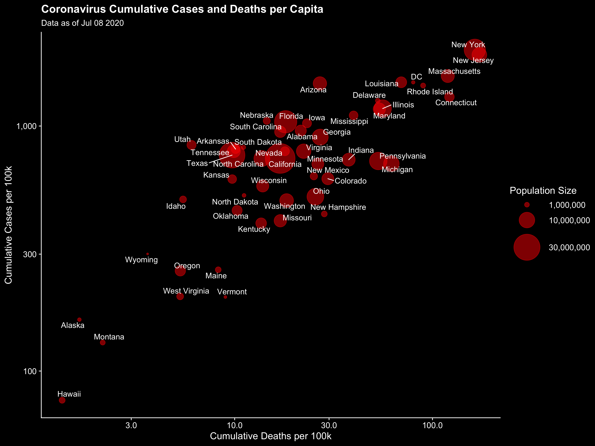

# Visualizing the Lagged Connection Between COVID-19 Cases and Deaths in the United States

This repository contains the code to produce the following visualizations, based on the [USA Facts COVID-19 data](https://usafacts.org/visualizations/coronavirus-covid-19-spread-map). 

Here's a static version of the data on the last date available:

The code to reproduce the visualization is in the [animation_script.R](animation_script.R) file, along with the code to read in the USA Facts dataset in [load_usafacts_data.R](load_usafacts_data.R).

The animation was rendered using the most recent available data on July 9th 2020.
